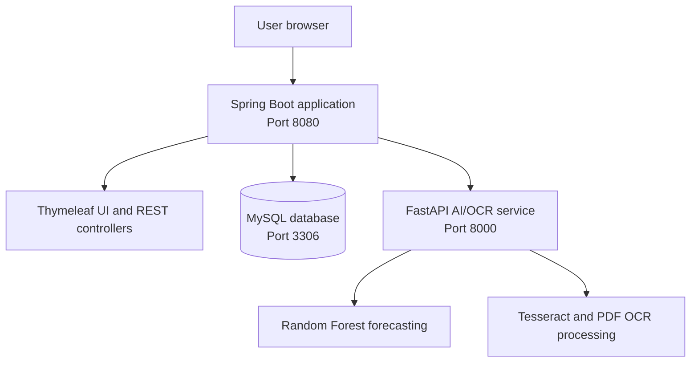

# StockSense

<p align="center"></p>


## StockSense Inventory and Demand Forecasting System

StockSense is an SME-focused inventory management system that brings together stock control, product and supplier management, sales/POS, OCR-assisted invoice processing, AI-supported demand forecasting, reports, audit logging and role-based access control in one web application.

The system uses a Spring Boot web application as the main platform and a separate Python/FastAPI service for OCR and forecasting tasks. OCR results are reviewed and validated by an authorised user before approved invoice items update inventory.

> **Project status:** StockSense is an academic demonstration and prototype system. It is suitable for structured testing and demonstration, but it has not been presented as a production-ready commercial deployment. Formal SME user-acceptance testing and larger labelled OCR/forecasting accuracy studies remain future work.

---

## Main Features

### Inventory and product management

- Product and category CRUD operations
- Supplier management
- Purchase-order support
- Stock-in and stock-out transactions
- Inventory adjustments and inventory history
- Low-stock monitoring
- Product image upload support
- Transaction records and audit history

### Sales and POS

- Product search and POS cart management
- Stock validation before completing a sale
- Automatic stock deduction after a completed sale
- Sales history and sale details
- Receipt generation and printing
- Support for configured payment methods

### OCR invoice processing

- Upload JPG, PNG and PDF invoices
- Extract invoice text using Tesseract and PDF processing tools
- Identify invoice and item information for review
- Display OCR output and confidence information where available
- Human validation and correction before approval
- Update inventory only after invoice data is approved
- Demo-mode fallback when a local Tesseract installation is unavailable

### AI demand forecasting

- Product-specific Random Forest regression forecasting
- Historical sales data analysis
- Configurable forecast horizon through the forecasting interface
- Forecast visualisation and supporting summary information
- Model status and on-demand retraining endpoints
- Moving-average fallback when the AI service or adequate historical data is unavailable
- MAE, RMSE and MAPE reporting only when sufficient evaluation data exists

### Reports and administration

- Inventory, sales and supplier reports
- Dashboard summaries and charts
- User management
- Role-based navigation and access control
- Audit-log viewing for authorised administrators
- Authentication, session control and protected routes

---

## Technology Stack

| Layer | Technology |
|---|---|
| Main application | Java 21, Spring Boot 3, Maven |
| Web interface | Thymeleaf, HTML, CSS, JavaScript and Chart.js |
| Security | Spring Security and role-based access control |
| Persistence | Spring Data JPA, Hibernate and MySQL 8 |
| AI/OCR service | Python 3.10+, FastAPI and Uvicorn |
| Forecasting | scikit-learn Random Forest regression |
| OCR | Tesseract OCR and PDF text-processing libraries |
| Testing database | H2 where configured by the test profile |
| Development tools | IntelliJ IDEA or Eclipse, XAMPP/phpMyAdmin optional |

---

## System Architecture



The Spring Boot application owns authentication, business rules, inventory, sales, reports and database transactions. The FastAPI service is called when OCR or forecasting functionality is used.

---

## System Requirements

| Component | Requirement |
|---|---|
| Java | JDK 21 |
| Maven | 3.8 or later |
| MySQL | MySQL 8 or compatible local installation |
| Python | Python 3.10 or later |
| Tesseract | Tesseract 4 or later for live OCR |
| Browser | Current Chrome, Edge, Firefox or Safari |
| IDE | IntelliJ IDEA or Eclipse |

XAMPP can be used to run MySQL and phpMyAdmin locally, but it is not mandatory if MySQL is already installed.

---

## Project Structure

```text
stocksense/
├── spring-boot-backend/
│   ├── pom.xml
│   └── src/
│       ├── main/java/com/stocksense/
│       │   ├── config/              # Application configuration
│       │   ├── controller/          # Web and REST controllers
│       │   ├── dto/                 # Request and response DTOs
│       │   ├── entity/              # JPA entities
│       │   ├── exception/            # Error handling
│       │   ├── repository/           # Spring Data repositories
│       │   ├── security/             # Spring Security configuration
│       │   └── service/              # Business logic
│       ├── main/resources/
│       │   ├── application.properties
│       │   ├── static/               # CSS, JavaScript and images
│       │   └── templates/
│       │       ├── auth/              # Login and profile pages
│       │       ├── dashboard/         # Dashboard
│       │       ├── products/          # Product and category pages
│       │       ├── suppliers/         # Supplier pages
│       │       ├── purchase-orders/   # Purchase-order pages
│       │       ├── inventory/         # Inventory and stock logs
│       │       ├── sales/             # POS, sales and receipts
│       │       ├── ocr/               # Invoice OCR workflow
│       │       ├── forecasting/       # Forecasting pages
│       │       ├── reports/            # Reports and analytics
│       │       ├── admin/              # Administration and audit pages
│       │       └── fragments/          # Shared layout fragments
│       └── test/                      # Application and entity tests
├── fastapi-service/
│   ├── main.py                        # FastAPI application entry point
│   ├── requirements.txt               # Python dependencies
│   ├── start.bat                      # Windows startup script
│   ├── start.sh                       # Linux/macOS startup script
│   ├── routers/                       # Forecast and OCR endpoints
│   ├── services/                      # Forecast and OCR services
│   ├── schemas/                       # Pydantic request/response models
│   └── ml_models/                     # Generated or saved model files
└── database/
    └── schema/
        ├── 01_schema.sql
        └── SALES_HISTORY_AI_FORECAST_2026-08-23.sql
```

---

## Quick Start

### 1. Configure and start MySQL

1. Start MySQL through XAMPP or your local MySQL installation.
2. Open phpMyAdmin at [http://localhost/phpmyadmin](http://localhost/phpmyadmin), or use the MySQL client.
3. Run the SQL files in this order:

   ```text
   database/schema/00_RESET_DATABASE_FOR_DEMO.sql
   database/schema/01_schema.sql
   database/schema/SALES_HISTORY_AI_FORECAST_2026-08-23.sql
   ```

The reset script is intended for a clean demonstration database. Do not run it against a database containing data that must be preserved.

### 2. Configure the Spring Boot application

Open:

```text
spring-boot-backend/src/main/resources/application.properties
```

Update the database and AI-service settings for the local machine:

```properties
spring.datasource.url=jdbc:mysql://localhost:3306/smart_inventory
spring.datasource.username=root
spring.datasource.password=
app.ai-service.base-url=http://localhost:8000
```

The password is commonly blank for a default XAMPP installation. Use the password configured on the local MySQL server.

### 3. Start the FastAPI service

From the project root:

#### Windows

```powershell
cd fastapi-service
.\start.bat
```

#### Linux or macOS

```bash
cd fastapi-service
chmod +x start.sh
./start.sh
```

#### Manual startup

```bash
cd fastapi-service
python -m venv .venv

# Windows PowerShell
.\.venv\Scripts\Activate.ps1

# Linux/macOS
source .venv/bin/activate

pip install -r requirements.txt
uvicorn main:app --reload --port 8000
```

The AI/OCR service is available at [http://localhost:8000](http://localhost:8000). Interactive API documentation is available at [http://localhost:8000/docs](http://localhost:8000/docs).

### 4. Start the Spring Boot application

1. Open `spring-boot-backend` in IntelliJ IDEA or Eclipse.
2. Allow Maven to download the dependencies.
3. Run `SmartInventoryApplication.java`, or the main class annotated with `@SpringBootApplication`, under `src/main/java/com/stocksense/`.
4. Open [http://localhost:8080](http://localhost:8080).

The Spring Boot application must be running before using the main StockSense web interface. The FastAPI service must also be running for live forecasting and OCR processing.

### 5. Install Tesseract for live OCR

Without Tesseract, the service can use its demonstration fallback where supported, but it will not perform full local OCR extraction.

#### Windows

- Install Tesseract from the [UB Mannheim Tesseract distribution](https://github.com/UB-Mannheim/tesseract/wiki).
- Add the Tesseract installation directory to the system `PATH` if the installer does not do so automatically.

#### Ubuntu/Debian

```bash
sudo apt-get update
sudo apt-get install tesseract-ocr
```

#### macOS

```bash
brew install tesseract
```

---

## Demonstration Accounts

These credentials are for local demonstration only and must be changed before any real deployment.

| Role | Username | Password | Main access |
|---|---|---|---|
| Administrator | `admin` | `admin123` | Full system access, users, audit logs, reports and transactions |
| Inventory manager | `manager` | `admin123` | Products, categories, suppliers, purchase orders, inventory, OCR, forecasting and reports |
| Staff | `staff1` | `admin123` | POS, sales history and receipts |

The administrator role is able to access the complete system, including sales history and inventory logs. Inventory managers and staff are restricted according to their assigned responsibilities.

---

## Role-Based Access Control

### Administrator

- Access all inventory, product, supplier, purchase-order, sales, OCR, forecasting and reporting functions
- Manage users and roles
- Review audit logs
- View sales history and inventory logs

### Inventory manager

- Manage products, categories and suppliers
- Manage purchase orders and inventory records
- Review and approve OCR invoice data
- Use demand forecasting
- View operational reports
- Cannot manage users or access administrator-only audit controls

### Staff

- Create sales through the POS interface
- View relevant sales history
- Generate or print receipts
- Cannot manage products, suppliers, inventory, OCR, forecasting, reports or users

---

## FastAPI Endpoints

| Endpoint | Method | Purpose |
|---|---:|---|
| `/api/forecast/predict` | POST | Generate a product demand forecast |
| `/api/forecast/retrain` | POST | Retrain the forecasting model when supported by the service |
| `/api/forecast/status` | GET | Return forecasting-service or model status |
| `/api/ocr/process` | POST | Process an uploaded invoice |
| `/api/ocr/status` | GET | Return OCR-service status |
| `/docs` | GET | Open the FastAPI interactive documentation |

Endpoint availability can depend on the checked-out project version and the local service configuration.

---

## Configuration

### Database connection

Edit `spring-boot-backend/src/main/resources/application.properties`:

```properties
spring.datasource.url=jdbc:mysql://localhost:3306/smart_inventory
spring.datasource.username=root
spring.datasource.password=your_mysql_password
```

### AI service URL

```properties
app.ai-service.base-url=http://localhost:8000
```

### File uploads

```properties
app.upload.dir=uploads
```

Ensure that the configured upload location is writable. Product images and uploaded invoice files should not be committed to GitHub unless they are intentionally included as demonstration assets.

---

## Testing

From the Spring Boot project directory:

```bash
cd spring-boot-backend
mvn clean test
```

The project includes application and entity-level tests. H2 may be used for isolated tests where the test profile is configured; MySQL is required for the full integrated demonstration.

For manual verification, test the main workflows in this order:

1. Login and role-based navigation
2. Product, category and supplier management
3. Inventory logs and stock adjustments
4. Purchase-order processing
5. POS sale, stock deduction and receipt generation
6. Sales history and reports
7. OCR upload, review, correction and invoice approval
8. Forecasting with available sales history
9. User management and audit-log access as administrator

The recorded verification is prototype evidence and does not replace formal SME user-acceptance testing or future labelled-model accuracy evaluation.

---

## Troubleshooting

| Problem | Check |
|---|---|
| Port 8080 is already in use | Stop the existing process or change `server.port` in `application.properties`. |
| Port 8000 is already in use | Stop the existing Uvicorn process or start FastAPI on another port and update `app.ai-service.base-url`. |
| Database connection fails | Confirm MySQL is running, the database name exists, and the username/password are correct. |
| Tables or demo data are missing | Run the three SQL files in the documented order. |
| OCR uses fallback/demo data | Install Tesseract and confirm it is available on `PATH`. |
| Forecasting is unavailable | Confirm the FastAPI service is running, the base URL is correct, and sufficient sales history exists. |
| Forecast quality is limited | Forecasts depend on the quantity and quality of historical sales data. |
| Product images are not displayed | Check the configured upload directory and confirm that it is writable. |
| Maven tests fail | Confirm JDK 21 is selected and run `mvn clean test` from `spring-boot-backend`. |

---

## Academic Project Scope and Limitations

StockSense demonstrates:

- Layered enterprise application architecture
- Spring Boot and Thymeleaf server-rendered web development
- DTO, repository and service patterns
- MySQL database design and JPA/Hibernate persistence
- Spring Security and role-based access control
- Integration between a Java application and a Python/FastAPI microservice
- OCR-assisted invoice entry with human validation
- AI-supported product demand forecasting
- Reports, transaction controls and audit logging

The current implementation is data-dependent. Forecast quality depends on historical sales records, while OCR quality depends on invoice layout, image quality and Tesseract availability. Future work includes formal SME user-acceptance testing, labelled OCR and forecasting evaluation datasets, stronger production security, containerisation, CI/CD, monitoring and deployment governance.

---

## GitHub Safety Checklist

Before pushing the project:

- Remove real passwords, API keys and private connection strings.
- Do not commit `.env` files or personal database exports.
- Review uploaded invoices and product images for personal or confidential information.
- Keep generated uploads and large model files out of Git when they are not required.
- Confirm that demonstration credentials are clearly marked as local-only.
- Confirm that the README paths match the files included in the repository.

---

## Licence

This repository was created for academic demonstration and assessment purposes. Add the licence required by your institution or project supervisor before publishing the repository publicly.

---

**StockSense v1.0 — Spring Boot 3, Java 21, FastAPI, MySQL and Random Forest forecasting**
